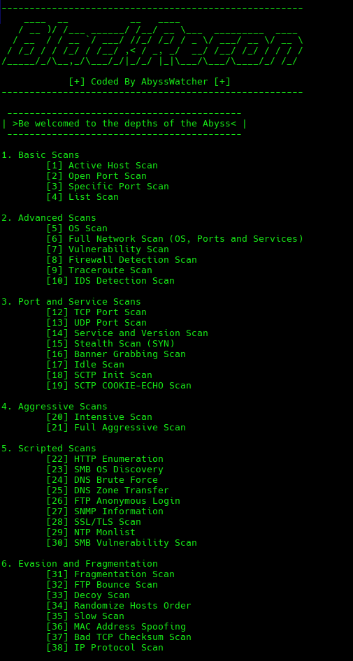

# BlackRecon

BlackRecon is an automated tool for efficiently and easily executing Nmap scan commands. The tool is aimed at experienced Nmap users who want a solid base of commands accessible with a single click. It provides a command-line interface to select and execute various types of scans, as well as display information about each one.

## Features

BlackRecon can execute 44 different scans, they are organized in categories to ensure a better lecture:

- Basic Scans
- Advanced Scans
- Port and Services Scans
- Agressive Scans
- Scripted Scans
- Evasion and Fragmentation Scans
- Specific Purpose Scans
- Saving Results

BlackRecon will show all the scanner list and will ask to enter the scan number you want to execute. Once you enter the scan number the program will ask you about the arguments of the specific command (if there is any on the scan you are executing).

You can also see a description and the respective command of each scanner entering <b>'info -scan number-'.</b> For example if you want to read the description of the scan number four you can enter this command:

    info 4

## Disclaimer

This program, BlackRecon, is provided for educational and informational purposes only. The author does not condone, promote, or encourage any illegal or unauthorized activities. Any actions and/or activities conducted with BlackRecon are solely the responsibility of the user. The author shall not be held responsible for any misuse of the information or tools provided by this program. It is the user's responsibility to abide by all applicable laws and regulations in their jurisdiction while using BlackRecon.

By using BlackRecon, you agree that you are solely responsible for any legal or ethical implications that may arise from your usage of the program. The author disclaims any responsibility for any harm resulting from the use or misuse of BlackRecon.

## Installation

You can install and run the program compilling it by your own or using the bash scripts:

### Manual Compilation (Debian Example)

First install the dependencies (nmap, gcc and figlet), then clone the repository and compile the program:

        sudo apt install nmap
        sudo apt install gcc
        sudo apt install figlet

        git clone https://github.com/UnknownArtistt/BlackRecon
        cd BlackRecon
        gcc -o BlackRecon BlackRecon.c

<b>Note that if you are going to executed advanced scans with BlackRecon you will need to execute the program with sudo, otherwise you can run it with your normal user

        sudo ./BlackRecon or ./BlackRecon

### Via Script (Debian Example)

First clone the repository and give the script executing permissions (choose the correct script for your distribution), then execute the script and once the script has been executed correctly run the program:

        git clone https://github.com/UnknownArtistt/BlackRecon
        cd BlackRecon
        chmod +x blackrecon_debian.sh
        sudo ./blackrecon_debian.sh

<b>Note that if you are going to executed advanced scans with BlackRecon you will need to execute the program with sudo, otherwise you can run it with your normal user

        sudo ./BlackRecon or ./BlackRecon
        
